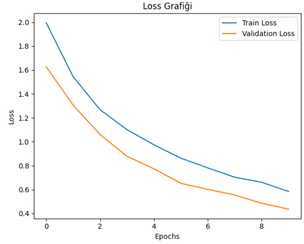
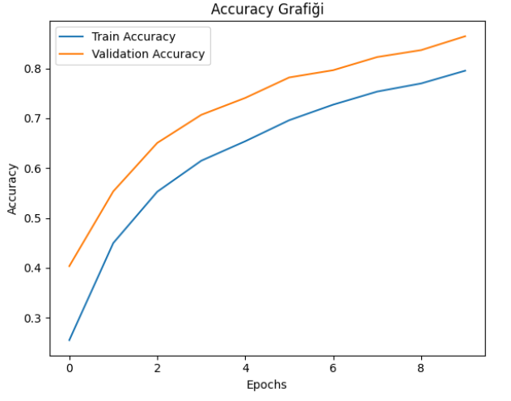

# Balık Görsellerinin Yapay Sinir Ağları (ANN) ile TensorFlow Kullanarak Sınıflandırılması

Bu projede, balık görsellerini sınıflandırmak için Yapay Sinir Ağları (ANN) kullanılmıştır. TensorFlow kütüphanesi ile geliştirilen model, çeşitli balık türlerine ait görüntüleri analiz ederek bu türleri doğru bir şekilde tanımlamayı hedeflemektedir. Modelin eğitimi için geniş bir veri seti kullanılmış, görüntü işleme teknikleri uygulanmış ve performans değerlendirmeleri yapılmıştır. Proje, derin öğrenme uygulamalarının görsel verilerin sınıflandırılmasındaki etkinliğini göstermeyi amaçlamaktadır.

## Veri Seti

- Bu veri seti, 9000 adet balık görseli içermekte ve farklı balık türleri hakkında bilgi sağlamaktadır.
- **Veri seti:** [9000 path (dosya yolu), 9000 label(etiket)]

## Sınıflandırma Modeli

Modelin yapısı ve parametreleri:

- **Giriş Katmanı:** Görüntü boyutuna uygun olarak verileri düzleştirir.
- **Gizli Katmanlar:** 2 adet gizli katman
    - **Dense Katmanları:** (256, 128) ve `ReLU` aktivasyon fonksiyonu kullanır.
- **Çıktı Katmanı:** 9 sınıfı tanımlamak için `softmax` aktivasyon fonksiyonu kullanır.
- **Dropout:** 0.2
- **Optimizasyon Algoritması:** Adam

## Sınıflandırma Sonuçları

| Class | Precision | Recall | F1-Score | Support |
|-------|-----------|--------|----------|--------|
| 0     | 0.79      | 0.98   | 0.87     | 211    |
| 1     | 0.93      | 0.81   | 0.87     | 204    |
| 2     | 0.89      | 0.90   | 0.90     | 195    |
| 3     | 0.94      | 0.93   | 0.93     | 191    |
| 4     | 0.96      | 0.93   | 0.94     | 201    |
| 5     | 0.81      | 0.89   | 0.85     | 179    |
| 6     | 0.86      | 0.95   | 0.90     | 209    |
| 7     | 0.87      | 0.79   | 0.83     | 207    |
| 8     | 0.91      | 0.74   | 0.82     | 203    |

- **Doğruluk (Accuracy):** 0.88
- **Makro Ortalama:** Precision: 0.88, Recall: 0.88, F1-Score: 0.88
- **Ağırlıklı Ortalama:** Precision: 0.88, Recall: 0.88, F1-Score: 0.88

## Model Performansı ve Epochlar Arası Karşılaştırma

Modelin eğitim sürecindeki performansı ve epochlar arası değişimi grafiklerle gösterilmektedir:
### Kayıp Fonksiyonu Grafiği (Loss Graph)

### Doğruluk Grafiği (Accuracy Graph)

## Model Performansı ve Yorum

Sonuç olarak, `Optimizer: Adam`, `2 Gizli Katman`, `Dense: 256, 128` ve `Dropout: 0.2` uygulamasıyla birlikte, yüksek performans gösteren dengeli bir model oluşturulmuştur. Bu yapılandırma, diğer parametrelerle elde edilen modellere göre genel olarak başarılı sınıflandırma sonuçları ve sağlam bir öğrenme süreci sağlamaktadır. Hem doğruluk hem de kayıp açısından tatmin edici sonuçlar elde edilmesi, bu yapılandırmanın pek çok uygulamada kullanılabilir olduğunu göstermektedir.

## Proje Çıktıları

- **Model Yapısı:** 
  - Gizli Katman Sayısı: 2
  - Dense Katmanlar: (256, 128)
  - Dropout: 0.2
  - Optimizer: Adam
- **Test Kaybı:** 0.44
- **Test Doğruluğu:** 0.88

## Proje Kaggle Linki

[Proje Kaggle Linki](https://www.kaggle.com/code/elifkd/deep-learning)

